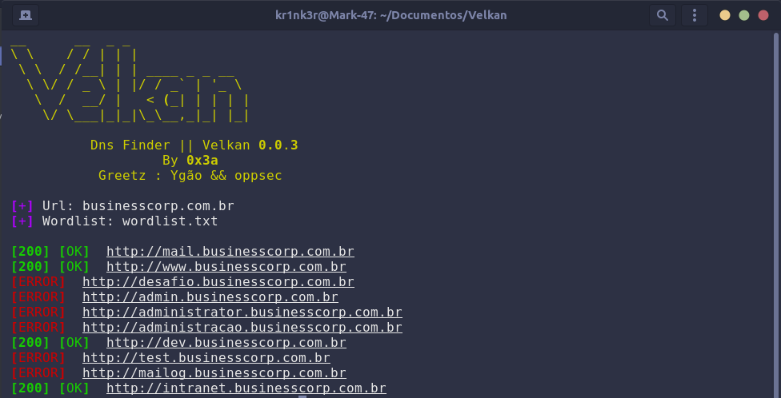

# Velkan
Velkan é uma ferramenta de brute force em sub-dominios 


## ⚙️ Pré-requisitos

Use [Python 3](https://www.python.org/downloads/)  
Use o pacote de Instalação [pip](https://pip.pypa.io/en/stable/) para obter as livrarias

## ⚡ Instalação 
Um Guia rapido de instalação e uso 

```shell
1. Copie o Repositorio com git clone https://github.com/0x3a1992/velkan.git
2. Acesse a pasta com cd velkan
2. Instale as livrarias pip3 install -r requirements.txt
3. Execute com  python3 main.py -u https://example.com -w wordlist.txt
```


## 🔨 Obrigado para:
Ygão && oppsec 


## Siga-me 
[](https://twitter.com/0x3a__)
